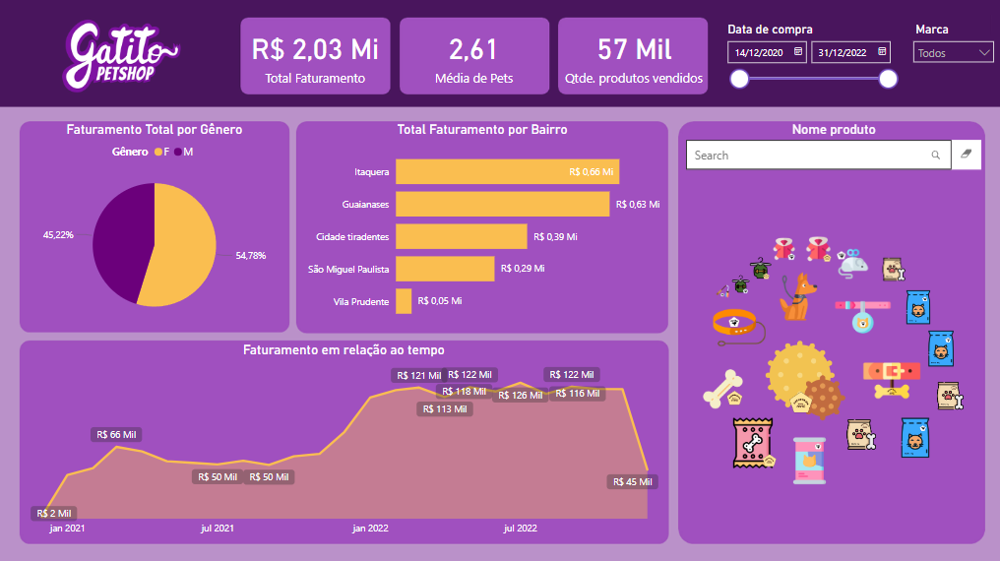
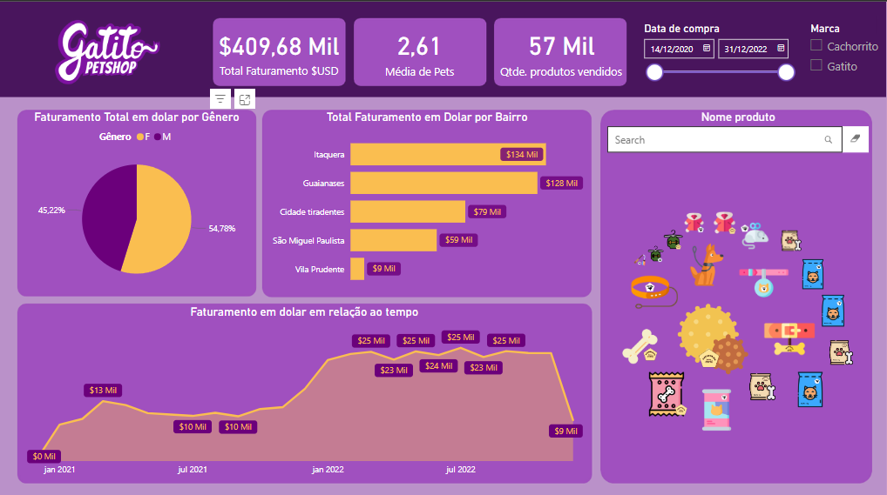

# Bl_Desktop_construindo_meu_primeiro_dashboard

O principal motivo deste repositório é compartilhar o projeto que fiz no curso da Alura - Power BI Desktop: Construindo meu primeiro dashboard.

O intuito do curso é montar um dashboard em torno do petshop gatito, onde a Helô é a dona. Ela precisa visualizar uma série de métricas importantes para tomar decisões baseadas em dados.

# O Projeto

O primeiro passo quando precisamos desenvolver algum projeto ou construir um dashboard para um(a) cliente ou empresa para a qual trabalhamos é: entender o que essa pessoa quer visualizar.
Para isso, precisamos de dois elementos:
 - Base de dados: para extrair métricas e fazer cálculos para construir os visuais;
 - Prioridades da empresa: entender o que é mais relevante e o que a empresa quer visualizar.

Portanto, ao questionar a Helô sobre esses pontos em relação ao Petshop, ela disse que era muito importante saber sobre o faturamento do negócio.

A Helô quer fazer um controle do faturamento dos últimos anos para entender se o negócio está crescendo ou se precisa fazer algum tipo de ajuste.

Além de visualizar o faturamento total do negócio, ela quer que seja disponibilizado o faturamento filtrado por marca. Dessa forma, ela pode saber quais são as marcas que mais vendem dentro do Petshop.

Ela também quer visualizar os produtos disponíveis, ou seja, fazer um controle de estoque. Assim, evita-se que falte determinado produto para a clientela do Gatito enquanto outro produto tem um estoque excessivo.

Além disso, a Helô quer saber o gênero que mais compra na loja, porque quer fazer algumas campanhas de marketing mais direcionadas. Assim, ela vai saber como está a divisão. Será que tem um gênero que compra mais que outro?

Ela quer descobrir qual a média de pets da clientela. Será que essas pessoas têm 1, 2 ou mais animais de estimação? Isso impacta na quantidade de produto que a Gatito vai comprar.

# Base de dados

A Helô quer fazer esse levantamento, pois pretende abrir novas lojas e crescer seu negócio. Para isso, ela precisa tomar decisões baseadas nesses dados.

Portanto, a Helô vai nos disponibilizar algumas bases de dados da Gatito sobre:

 - Clientes: arquivo no formato txt (texto); Repositório;
 - Produtos: arquivo no formato do Google Sheets (Google Planilhas); link https://docs.google.com/spreadsheets/d/e/2PACX-1vQuBG-JoWaeQF5rF3RgZYl5Z-PaJyDBK1I1c8a56RssNGoOlInqQROKi3z54u74E2ei32p_SWOpBb0v/pubhtml
 - Vendas: arquivos em uma pasta de trabalho do Excel. Repositório;

# Projeto Finalizado

# Insigths

O desenvolvimento do projeto, teve como finalizade responder as perguntas da Helô de forma dinâmica com a utilização do dashboard.

- Fácil percepção do faturamento total;
- Identificação de Períodos de Alta e Baixa Receita: Com o gráfico de faturamento em relação ao tempo.
- Perfil dos Clientes: Identificação dos principais segmentos de clientes, utilizando o gráfico de pizza, ajudando na criação de campanhas de marketing direcionadas.
- Nova Filial: Utilizando o gráfico de barras com o total de faturamento por bairro, pode-se verificar qual o proximo bairro para uma nova filial.
- Controle de estoque: Ao pesquisar o produto.

# Conclusão

Este projeto evidenciou como o Power BI pode ser uma ferramenta extremamente eficaz para análise financeira. Graças ao relatório criado, o Pet Shop Gatitos agora tem uma visão completa e detalhada de sua situação financeira, o que possibilita uma administração mais informada e estratégica.

Além disso, o processo de ETL (Extract, Transform, Load) realizado durante a implementação do Power BI foi crucial para garantir a integridade e a qualidade dos dados analisados. A combinação de extração eficiente, transformação precisa e carregamento correto dos dados permitiu que o Pet Shop Gatitos obtivesse insights precisos e confiáveis ​​sobre sua performance financeira.

# Desafio

- A Gatito vai apresentar o seu faturamento para investidores estrangeiros. Para isso, vamos precisar gerar uma nova coluna de faturamento, passando o seu valor de reais para dólares. Use a cotação do dólar de 4,95 para fazer essa conversão.

- Crie uma nova medida que apresente o Faturamento Total em dólar, certifique que seu formato está em moeda - inglês (estados unidos).

- Atualize os visuais que utilizam o Faturamento Total em reais para nova medida criada no exercício 2

- No relatório temos um filtro de marca para realizar análise segmentada, nossos dados possuem apenas dois tipos de marcas, altere o tipo desse filtro que dê visibilidade a todas as marcas da empresa.

- Atualize o visual do gráfico de barras horizontais passando uma cor que destaque mais o rótulos dos dados. Dica: Utilize a paleta de cores do projeto para essa etapa.

# Desafio Concluido

